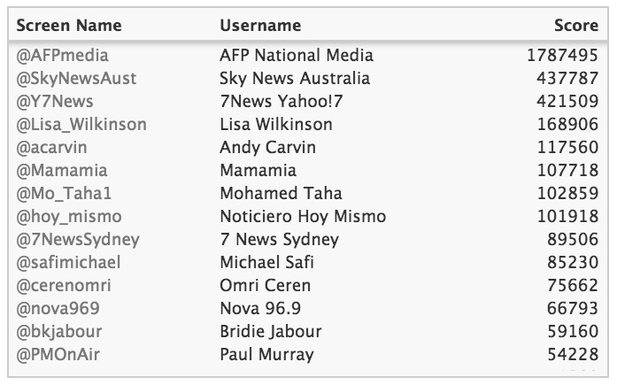

# Visualizing the Spread of Rumors on Twitter during Disaster Events
This project visualizes the effect that "major players" have on the spread of rumors on Twitter during disaster events.

### Final Communication Deliverables
  1. [Final Project](bit.do/twitter-rumors)
  2. [Poster](final/512_poster.pdf)
  3.
### Initial Communication Deliverables
  1. [Initial Project Proposal](https://docs.google.com/document/d/1G6vW-GAeq-mX6US2j_Rz23d2uaMBJ6ylGfGI2mhAF5M/edit?usp=sharing)

## Background
The Emerging Capacities of Mass Participation (emCOMP) Lab at the University of Washington studies the collective sense-making process that takes place on Twitter during crisis events. During an event, they collect tweets related to specific topics, or rumors, and analyze them with a variety of existing methods.

They are currently investigating how specific Twitter accounts can have a large effect on the direction that a rumor spreads. They want to be able to identify which accounts are the “major players”, i.e. those who strongly influence the spread of a rumor in a certain direction, while still getting an overall sense of the rumor. Our work provides a new tool they can use to further their research.

## Our Design
We had two main goals when designing our tool. The first was to build visualizations that brought more emphasis to their primary task, finding the accounts that were “major players”, than existing methods. The second was to automate many of the database queries and data processing needed to analyze the data.

The main panel displays the retweet lifecycle of individual tweets over time. Each line is a tweet, whose color indicates its code. A tweet travels from left to right over time on the x-axis. Its total exposure (an aggregate of the follower counts of all accounts that have emitted the tweet) is measured on the y-axis.

The stream graph in the main panel shows the coded tweet volumes over time. When a selection is made here, the
other components update to reflect the new time viewport. Two views, one by area, and one by volume, are provided for a better understanding of different trends.

The leaderboard allows users to view an overall summary of the most influential accounts across the current time viewport.

Users can hover or click on a line in the main panel to get details about that tweet in the side panel. This information includes the original tweet and the names and follower counts of all accounts emitting that tweet.

### Installation Instructions

  1. Install node and npm if you have not done so
  2. If you do not have bower or gulp installed, run `sudo npm install -g bower && sudo npm install-g gulp`
  3. Run `npm install && bower install`
  4. Run `gulp`
