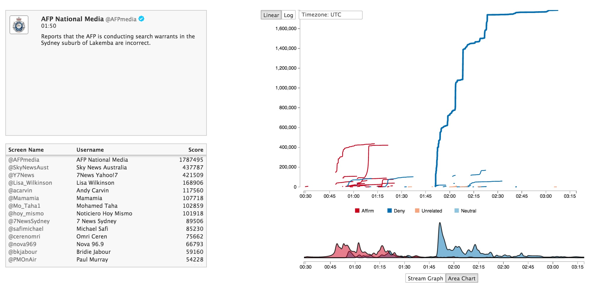
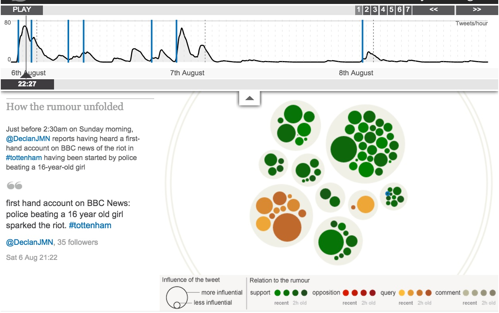

# Visualizing the Spread of Rumors on Twitter during Disaster Events
This project visualizes the effect that "major players" have on the spread of rumors on Twitter during disaster events.

### Team Members and Work Breakdown
Cynthia Andrews
Graeme Britz
Rama Gokhale
Zeno Koller

Early on in the project, all four team members played a part in the direction that the project took. Graeme took on the role of project manager, scheduling and leading meetings. Once the initial concept was roughly figured out, Graeme and Zeno did majority of the development for this project, with Rama contributing a little as well. Rama also was primarily in charge of the project proposal slideshow and final poster. Cynthia was the primary author of both the project proposal and the final paper.

### Final Communication Deliverables
  1. [Link to project](bit.do/twitter-rumors)
  2. [Poster](final/512_poster.pdf)
  3. [Final Paper]()

### Initial Communication Deliverables
  1. [Initial Project Proposal](https://docs.google.com/document/d/1G6vW-GAeq-mX6US2j_Rz23d2uaMBJ6ylGfGI2mhAF5M/edit?usp=sharing)

## Background
The Emerging Capacities of Mass Participation (emCOMP) Lab at the University of Washington studies the collective sense-making process that takes place on Twitter during crisis events. During an event, they collect tweets related to specific topics, or rumors, and analyze them with a variety of existing methods.

They are currently investigating how specific Twitter accounts can have a large effect on the direction that a rumor spreads. They want to be able to identify which accounts are the “major players”, i.e. those who strongly influence the spread of a rumor in a certain direction, while still getting an overall sense of the rumor. Our work provides a new tool they can use to further their research.

# Our Research Process
One of the first things we did was to meet with Kate Starbird, our project mentor, to learn more about the specifics of what she wanted from us. After getting some initial datasets and background, we started researching for existing visualizations in this space and brainstorming some initial ideas.

The current landscape of visualizations that examine rumoring on Twitter is scarce and we found only one satisfactory example that addresses rumoring on Twitter and how information spreads during crisis events. Developed by the Guardian, this visualization focuses on the spread of rumors and how the sentiment of participants changes over time and its prime directive is to “show the birth and death of rumours on Twitter”.

In this interactive example, tweet volume over time is displayed in the top panel, “how the rumor unfolded” is shown in the left panel, which updates at pivotal moments (marked with blue on the above time series) while the tweet of interest at the time is displayed below. In the main panel, which morphs as the animation plays and “time passes” tweets are clustered based on similarities in the text of the tweets. The influence of an author, which is determined by follower count is indicated by the size of a given circle and whether it supports, opposes, questions or comments on a rumor is indicated using color and value. The play function allows the story of rumoring to be told over time and the volume timeline allows users to see peak periods of conversation and if desired, focus only on a certain time.

While this was a cool visualization, we wanted to focus more on the "major players" instead of specific tweets. We showed our initial prototypes to Kate and iterated on that till we got a design both of we both liked.

# Our Development Process
We found inspiration for this design in an exploration of the interactive capabilities of D3 made using randomly generated time series data. The bottom chart is used to navigate the main plot using the “viewport” which allows users to choose a time period of interest and investigate that data further.  This viewport is adjustable and can also be removed completely. The combination of charts paired with interaction allows users to see the relationship of the main chart to the overall data set. 

The main panel is implemented as a D3 component which facilitates redrawing after a viewport change. Highlighting the currently closest line on mousing over the panel is accomplished by overlaying a Voronoi tessellation of all the points of the line. This geometrical data structure assigns to every point in the space of the chart the closest point on one of the lines, which is then highlighted by referencing it. For both the linear and the logarithmic view, tessellations have to be computed, which are switched as needed.

The retweet list and the leaderboard make use of a table component written in D3. After trying out several libraries for drawing tables with exchangeable data, we found that none of those would fit our needs as they were either bloated or hard to customize. Therefore, we decided on implementing our own. It features a fixed header. Clicking one of the header fields allows changing the sort order to the attribute of the respective column. Another click on the same header field toggles ascending / descending sort order. 

## Our Final Design
We had two main goals when designing our tool. The first was to build visualizations that brought more emphasis to their primary task, finding the accounts that were “major players”, than existing methods. The second was to automate many of the database queries and data processing needed to analyze the data.

The main panel displays the retweet lifecycle of individual tweets over time. Each line is a tweet, whose color indicates its code. A tweet travels from left to right over time on the x-axis. Its total exposure (an aggregate of the follower counts of all accounts that have emitted the tweet) is measured on the y-axis.

The stream graph in the main panel shows the coded tweet volumes over time. When a selection is made here, the
other components update to reflect the new time viewport. Two views, one by area, and one by volume, are provided for a better understanding of different trends.

The leaderboard allows users to view an overall summary of the most influential accounts across the current time viewport.

Users can hover or click on a line in the main panel to get details about that tweet in the side panel. This information includes the original tweet and the names and follower counts of all accounts emitting that tweet.

### Installation Instructions

  1. Install node and npm if you have not done so
  2. If you do not have bower or gulp installed, run `sudo npm install -g bower && sudo npm install-g gulp`
  3. Run `npm install && bower install`
  4. Run `gulp`
